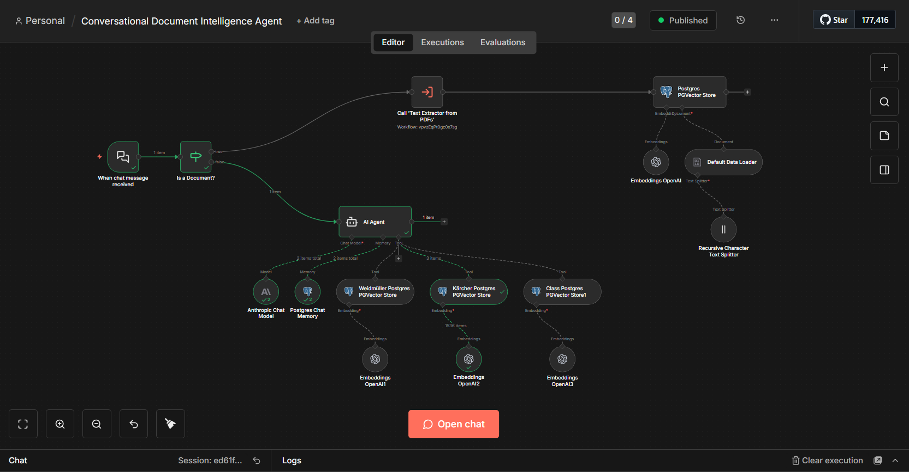
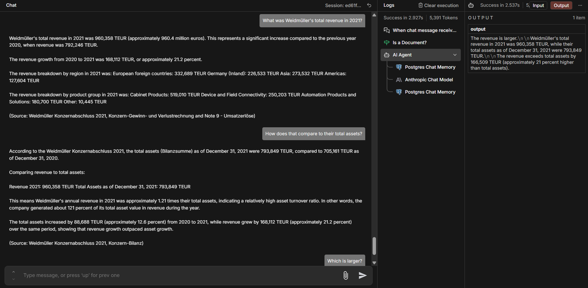

# Conversational Document Agent

A small n8n proof of concept: ask questions in a chat about several company annual reports (PDF). Each report has its own retrieval tool over a PostgreSQL vector store. Local prototype, not a production service.

## How it works

The workflow is in `n8n/workflows/Conversational Document Intelligence Agent.json`.

- **A PDF is attached to the chat message:** the text is extracted by the sub-workflow [Text Extractor from PDFs](https://github.com/Javier-Briceno/PDF-Text-Extractor-Workflow), split into chunks (recursive splitter, overlap 150), embedded with OpenAI and stored in the pgvector table `document_chunks`, tagged with the file name.
- **A question without a file:** an agent (Claude Sonnet 4.5, with the last 4 messages as Postgres chat memory) answers it. It has three retrieval tools, each fixed to one file name:

| Tool | File name filter |
|---|---|
| Weidmüller | `weidmuller_konzern_2021.pdf` |
| Kärcher | `kaercher_konzern_2021.pdf` |
| CLAAS | `class_konzern_2021.pdf` |

The agent decides which tool to call. That choice is made by the model, so it can pick the wrong company.

## Setup

1. Import this workflow and the [Text Extractor from PDFs](https://github.com/Javier-Briceno/PDF-Text-Extractor-Workflow) workflow into n8n, and point the `Call 'Text Extractor from PDFs'` node at it.
2. Add credentials for Anthropic, OpenAI and a PostgreSQL database with the `pgvector` extension.
3. Upload the reports through the chat. They are public annual reports from the Bundesanzeiger and are not included here. The file names must match the filters above exactly.

## Limits

- Tested by hand with a few questions on the Weidmüller report. There are no automated tests.
- A new document needs a new retrieval node with its own filter.
- The chat has no authentication. Run it locally only.
